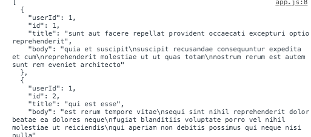
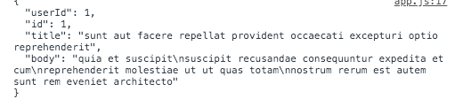
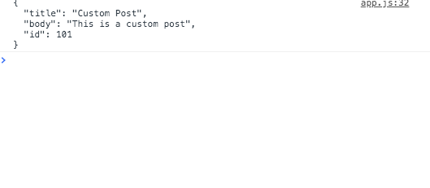
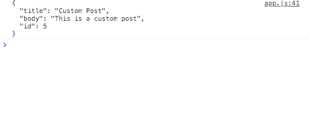
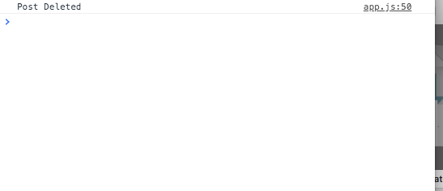

# Custum-HTTP-Library

## Application description:

In this application, I used a Rest API to  to Get, Post, Put, and Delete  HTTP Requests  using Json place holder which is a fake API for testing and prototyping.

 ## Click [here](
https://brianlevin.github.io/Custum-HTTP-Library/) for the live app. 
 
 This is GET requesting multiple posts:
 
 
  
  
 This is GET requesting one post:
  
  
  
  This is creaing and making a POST request:
   
   
   This is updaing the post id using a PUT request:
   
   
   This is deleting the post using a DELETE request:
   

   
## Libraries and Frameworks:

- HTML
- CSS
- Javascript

## Email:

bml201095@gmail.com

